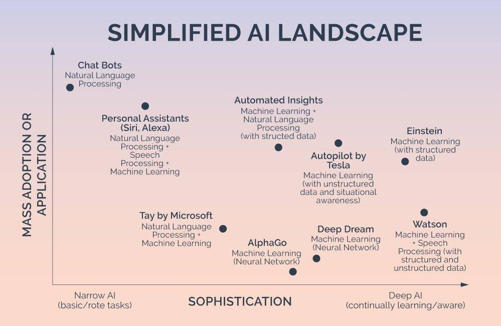

# Cognitive Computing

Cognitive computing (CC) describes technology platforms that, broadly speaking, are based on the scientific disciplines of artificial intelligence and signal processing. These platforms encompass machine learning, reasoning, natural language processing, speech recognition and vision (object recognition), human–computer interaction, dialog and narrative generation, among other technologies {Wikipedia}

