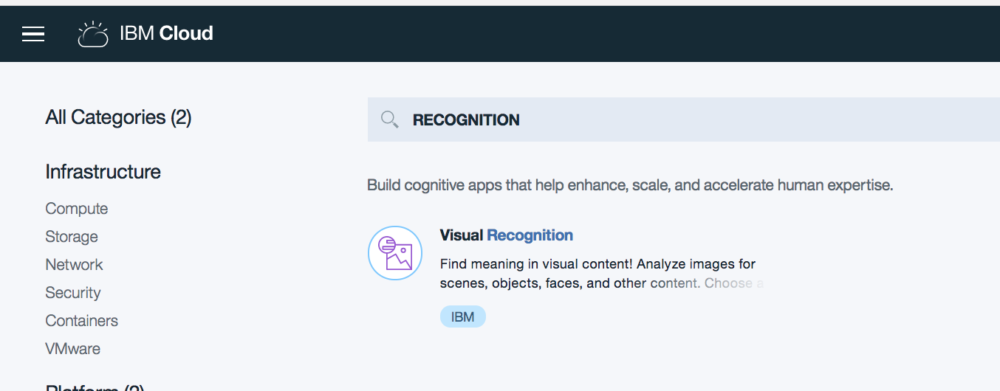
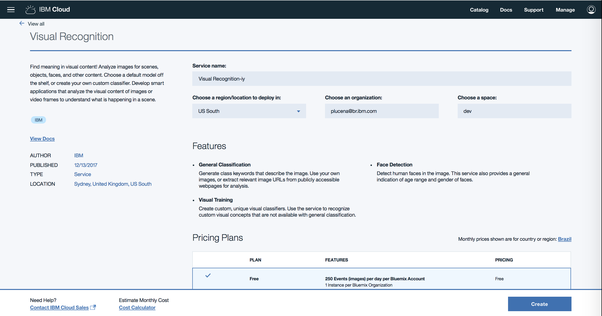

# Demo 
https://visual-recognition-demo.ng.bluemix.net

# Create Service

1 - Login to bluemix

2 - Search for RECOGNITION
https://console.bluemix.net/catalog/?category=watson&search=RECOGNITION

3 Click on Create Button

4 - Find your API key. Go to https://console.bluemix.net/dashboard/apps and select watson-vision service

#visual recognition tool
https://watson-visual-recognition.ng.bluemix.net

curl -X POST --form "images_file=@fruitbowl.jpg" \
"https://gateway-a.watsonplatform.net/visual-recognition/api/v3/classify?api_key={api-key}&version=2016-05-20"
